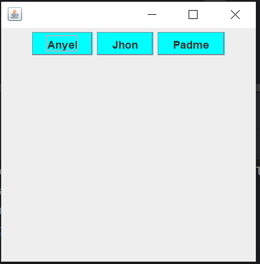

# **Select Language:** 🌍 
- [Español (Spanish)](README-es.md)
- [English](README.md)

# Creación y Uso de ButtonColor Component en Java

Este documento describe cómo crear un componente `ButtonColor` en Java desde cero, compilarlo en un archivo `.jar` y utilizarlo como una librería externa en otro proyecto.

## Creación del Componente ButtonColor

El componente `ButtonColor` es una extensión de `JButton` que cambia de color cuando el mouse entra o sale del área del botón.

## RESULTS
### Component Only of an button with color change

### Call components



```java
package top.anyel.component;

import javax.swing.*;
import java.awt.*;
import java.awt.event.MouseAdapter;
import java.awt.event.MouseEvent;

public class ButtonColor extends JButton {

    public ButtonColor(String text) {
        super(text);

        // color default
        this.setBackground(Color.CYAN);

        this.addMouseListener(new MouseAdapter() {
            @Override
            public void mouseEntered(MouseEvent evt) {
                setBackground(Color.BLUE);
            }

            @Override
            public void mouseExited(MouseEvent evt) {
                setBackground(Color.CYAN);
            }
        });

    }

}
```

## Compilación y Generación del .jar

Una vez que se ha creado el componente, se puede compilar y generar un archivo `.jar` para su uso en otros proyectos. Aquí se muestra un ejemplo de cómo hacerlo:

```shell
$ javac ButtonColor.java
$ jar cvf ButtonColor.jar top/anyel/component/ButtonColor.class
```

## Uso del Componente en Otro Proyecto

Para utilizar el componente `ButtonColor` en otro proyecto, sigue estos pasos:

1. Agrega el archivo `.jar` generado como una librería externa en el proyecto.

2. Llama al componente `ButtonColor` desde tu código como se muestra a continuación:

```java
package top.anyel;

import top.anyel.component.ButtonColor;

import javax.swing.*;
import java.awt.*;

public class Main extends JFrame {
    public Main() {
        this.setDefaultCloseOperation(JFrame.EXIT_ON_CLOSE);
        // centrar en el medio de la pantalla
        this.setLocationRelativeTo(null);
        this.setSize(300, 300);
        this.setLayout(new FlowLayout());
        // components here
        this.add(new ButtonColor("Anyel"));
    }

    public static void main(String[] args) {
        new Main().setVisible(true);
    }
}
```