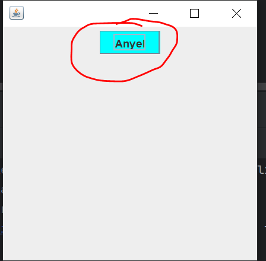
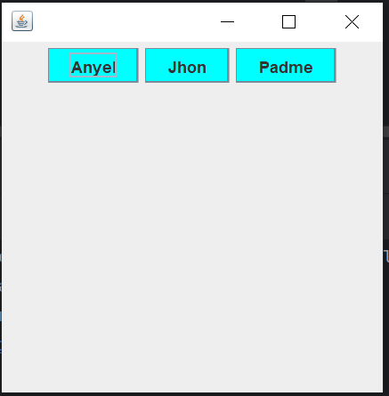

# **Select Language:** 🌍
- [Español (Spanish)](README-es.md)
- [English](README.md)

# Creating and Using ButtonColor Component in Java

This document describes how to create a `ButtonColor` component in Java from scratch, compile it into a `.jar` file, and use it as an external library in another project.

## RESULTS
### Component Only of an button with color change

### Call components


## Creating the ButtonColor Component

The `ButtonColor` component is an extension of `JButton` that changes color when the mouse enters or exits the button area.

```java
package top.anyel.component;

import javax.swing.*;
import java.awt.*;
import java.awt.event.MouseAdapter;
import java.awt.event.MouseEvent;

public class ButtonColor extends JButton {

    public ButtonColor(String text) {
        super(text);

        // default color
        this.setBackground(Color.CYAN);

        this.addMouseListener(new MouseAdapter() {
            @Override
            public void mouseEntered(MouseEvent evt) {
                setBackground(Color.BLUE);
            }

            @Override
            public void mouseExited(MouseEvent evt) {
                setBackground(Color.CYAN);
            }
        });

    }

}
```

## Compilation and Generation of the .jar

Once the component has been created, it can be compiled and a `.jar` file generated for use in other projects. Here's an example of how to do it:

```shell
$ javac ButtonColor.java
$ jar cvf ButtonColor.jar top/anyel/component/ButtonColor.class
```

## Using the Component in Another Project

To use the `ButtonColor` component in another project, follow these steps:

1. Add the generated `.jar` file as an external library in the project.

2. Call the `ButtonColor` component from your code as shown below:

```java
package top.anyel;

import top.anyel.component.ButtonColor;

import javax.swing.*;
import java.awt.*;

public class Main extends JFrame {
    public Main() {
        this.setDefaultCloseOperation(JFrame.EXIT_ON_CLOSE);
        // center on screen
        this.setLocationRelativeTo(null);
        this.setSize(300, 300);
        this.setLayout(new FlowLayout());
        // components here
        this.add(new ButtonColor("Anyel"));
    }

    public static void main(String[] args) {
        new Main().setVisible(true);
    }
}
```

Following these steps, you should be able to create, compile, and use the `ButtonColor` component effectively in your Java projects.